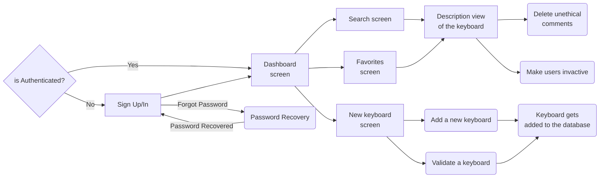

# Administrator Flow

## Administrator Flow documentation
Administrators manage the application and can ban users for unethical activities like chat spamming or being disrespectful.

### What an administrator can do?
* Everything that a [user](https://github.com/Vlastrix/keytastic_backend/blob/main/docs/flow_of_keytastic/userFlow.md) can do.
* Delete comments.
* Ban users (make them inactive).
* Validate keyboards sent by users (add them to the app).
* Add a new keyboard to the app.
