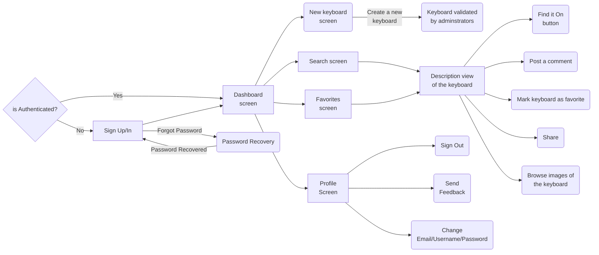

# User Flow

## User Flow documentation
Everytime a new account is created it starts with the role of "user". A user can view the available keyboards in the app and add a new keyboard for validation by the administrators. 

### What a user can do?
* Post comments on a keyboard.
* Share a keyboard.
* Mark keyboard as favorite.
* Browse images of the keyboard
* Search a keyboard by tags.
* Search a keyboard by name.
* Add a new keyboard for validation.
* Change his username.
* Change his email.
* Change his password.
* Send feedback to the developers about the app.
* Press the "Find On" button.

### What is the "is Authenticated?" question?
The app checks authentication with  a JWT (Json Web Token), if there is a token and if it is validated, the user is authenticated and can use the app, the dashboard screen gets shown.
 
If the token is expired or there is no token at all, the user is sent to the Sign In screen. If it is the first time using the app the user is sent to the Sign Up screen. After Signing Up\In the user can use the app, the dashboard screen gets shown.

### What are the "Sign Up/In screens"?
In these screen the user is taken throught a process of authentication by Signing Up/In so he can obtain the JWT (Json Web Token). The JWT is created each time a user Signs Up/In with the correct credentials.

### What is "Password Recovery" button?
It initializes the password recovery... (to be implemented in the future).

### What is the "Dashboard screen"?
In this screen the most popular keyboards gets shown.It is calculated by the highest numbers of views and the highets number of marked as favorite.

### What is the "Search screen"?
In this screen the user can browse keyboards by selecting tags or by writing a keyboard name.

### What is "Favorites screen"?
In this screen appears all the keyboard that the user marked as favorite by pressing the heart button in "Description view" of the keyboard.

### What is the "Profile screen"?
In this screen the user can change his username, email and password. He can also choose to Sign Out or to send feedback about the app to the developers.

### What is the "New Keyboard" screen?
In this screen users can add a new keyboard for validation, the user needs to specify the images, technical detais, features and where you can find it to buy it. These new keyboards can be modified or corrected by the administrators and then added to the database of the app. 

### What is the "Description view" of the keyboard?
In this screen the user can see all of the details and features of a keyboard. Here the user can mark the keyboard as favorite, share it, browse images or post a comment.

### What is the "Find it On" button?
This button appears in the description view of the keyboard, it leads to a e-commerce website where you can buy the keyboard you selected.
