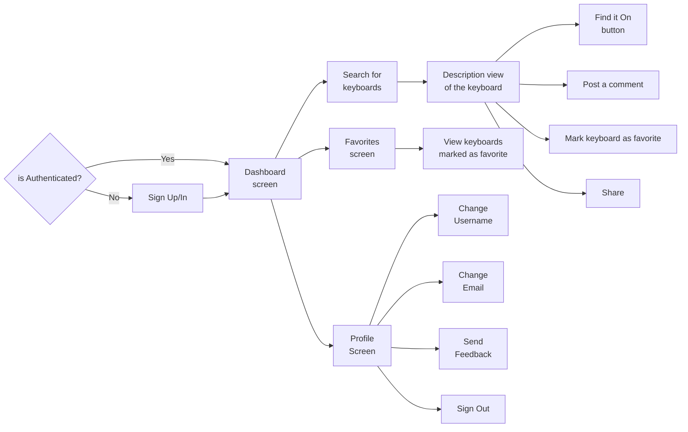

# User Flow

## User Flow documentation
A user can view and read. The user dosen't modify the content of the app, he can only interact with it.

### What a user can do?
* Post comments on a keyboard.
* Share a keyboard.
* Mark keyboard as favorite.
* Search a keyboard by tags.
* Search a keyboard by name.
* Change his username.
* Change his email.
* Send feedback to the developers about the app.
* Press the "Find On" button.

### What is the "Find On" button?
This button appears in the description view of the keyboard, it leads to a e-commerce website where you can buy the keyboard you selected.
