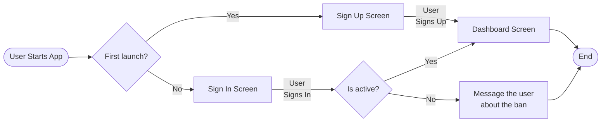
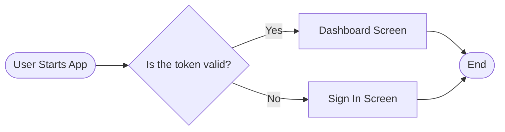
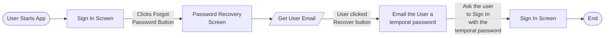

# Authentication Flow

## Sign Up and Sign In

### What is the "Message the user about the ban" action?
Tells the user that the account with which he tried to Sign In is banned.

Each time the user Sign Up/In a Json Web Token is sent to the client to be saved. The JWT expires in 24 hours
If the user closes the application and then opens it again, the application will check if the token is still validated, if it is, the user can use the app, if not, the user is asked to Sign In again.

## Password Recovery

In order to recover the password the app asks for the users Email and sends him a new temporal password with which he can Sign In and change his password to a new one in the Profile Screen.