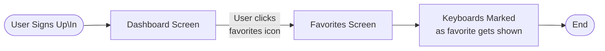

# Favorites Flow

```mermaid
flowchart LR
    id1([User Signs Up\In]) --> id2[Dashboard Screen]
    id2 --> |User clicks \n favorites icon| id3[Favorites Screen]
    id3 --> id4[Keyboards Marked \n as favorite gets shown]
    id4 --> id5([End])
```

## How can I mark a keyboard as favorite?
In the description screen you can click the heart icon and mark the keyboard as favorite.
