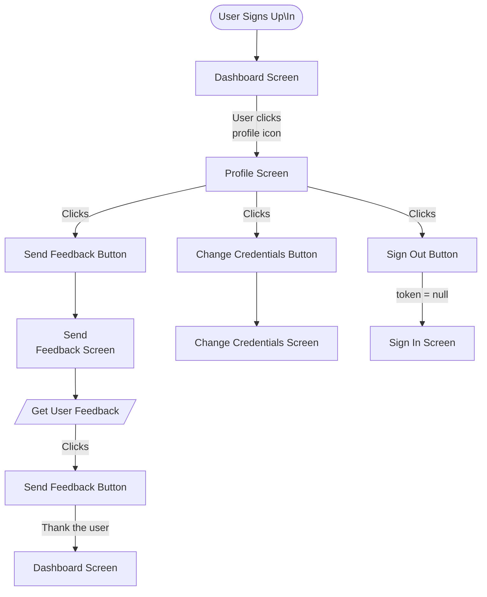

# Search Flow

```mermaid
flowchart
    id1([User Signs Up\In]) --> id2[Dashboard Screen]
    id2 --> |User clicks \n profile icon| id3[Profile Screen]
    id3 --> |Clicks| id4[Sign Out Button]
    id3 --> |Clicks| id5[Change Credentials Button]
    id3 --> |Clicks| id7[Send Feedback Button]
    id7 --> id6[Send \n Feedback Screen]
    id5 --> id8[Change Credentials Screen]
    id4 --> |token = null| id9[Sign In Screen]
    id6 --> id10[/Get User Feedback/]
    id10 --> |Clicks| id11[Send Feedback Button]
    id11 --> |Thank the user| id12[Dashboard Screen]
    
```