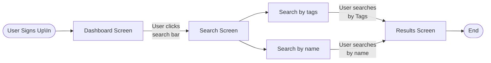

# Search Flow

```mermaid
flowchart LR
    id1([User Signs Up\In]) --> id2[Dashboard Screen]
    id2 --> |User clicks \n search bar| id3[Search Screen]
    id3 --> id4[Search by tags]
    id3 --> id5[Search by name]
    id4 --> |User searches \n by Tags| id6[Results Screen]
    id5 --> |User searches \n by  name| id6
    id6 --> id7([End])
    
```