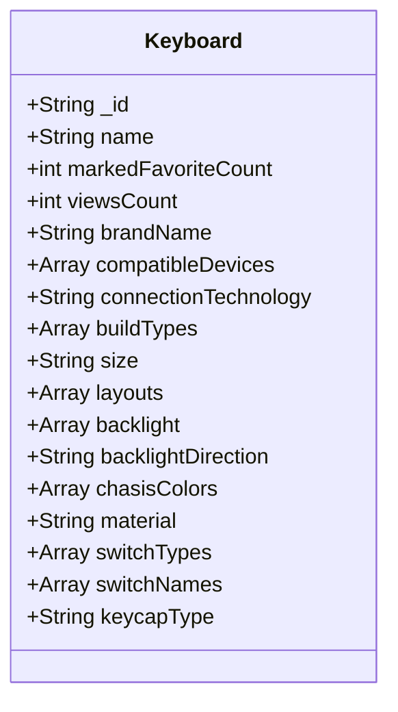

# Keyboard model

## Keyboard model documentation 
* String _id: Unique object id generated by mongoDB.
* String name: Name of the keyboard.
* int markedFavoriteCount: Integer that represents the number of times that the keyboard got marked as favorite by the users.
* int viewsCount: Integer that represents the number of times the keyboard was viewed by the users.
* String brandName: Brand of the keyboard, example 'Redragon'.
* Array compatibleDevices: A list that specifies the compatible devices for the keyboard, the values can be 'PC' or 'MacOS'.
* String connectionTechnology: Specifies the connection technology of the keyboard, the values can be 'wired' or 'wireless'.
* String buildType: Specifies if the keyboard is fully built or if it is barebones, the values can be 'Prebuilt' or 'Barebones'.
* String size: Specifies the keyboard size, the values can be 'Full Size', 'TKL', '75%', '60%' and etc.
* String layout: Specifies the keyboard layout, the values can be 'ISO' or 'ANSI'.
* String backlight: Specifies the keyboard backlight, the values can be 'None', 'White', 'Single Color' or 'RGB'.
* String backlightDirection: Specifies the keyboard backlight direction, the values can be 'north-facing' or 'south-facing'.
* Array availableChasisColors: Specifies a list of the available chasis color of the keyboard.
* String material: Specifies the keyboard material type, tha values can be 'Metal' or 'Plastic'.
* Array switchTypes: Specifies the switch type of the keyboard if it is prebuilt, the values can be 'Linear', 'Tactile' or 'Clicky'.
* Array switchNames: Specifies the name of the switch if the keyboard is prebuilt.
* String keycapType: Specifies the keycap type if the keyboard is prebuilt, the values can be 'ABS', 'PBT', 'Double shot ABS' or 'Double shot PBT'.