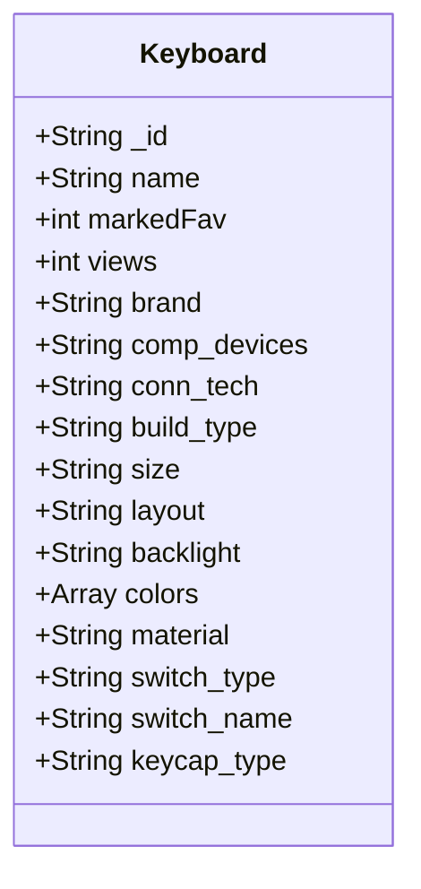

## Keyboard Class Documentation 
* String _id: Unique object id generated by mongoDB.
* String name: Name of the keyboard
* int markedFav: Integer that represents the number of times that the keyboard got marked as favorite by the users.
* int views: Integer that represents the number of times the keyboard was viewed by the users.
* String brand: Brand of the keyboard, example 'Redragon'.
* String comp_devices: Specifies the compatible devices for the keyboard, the values can be 'PC' or 'MacOS'
* String conn_tech: Specifies the connection technology of the keyboard, the values can be 'wired' or 'wireless'
* String build_type: Specifies if the keyboard is fully built or if it is barebones, the values can be 'Prebuilt' or 'Barebones'
* String size
* String layout
* String backlight:
* Array colors:
* String material:
* String switch_type:
* String switch_name:
* String keycap_type: