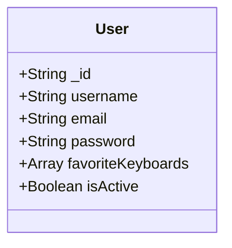

# User model

## User model documentation 
* String _id: Unique object id generated by mongoDB.
* String username: Users username.
* String email: User email.
* String password: User hashed password.
* Array favoriteKeyboards: A list composed of keyboards class unique ids.
* Boolean isActive: Defines if the user is able to log in.

