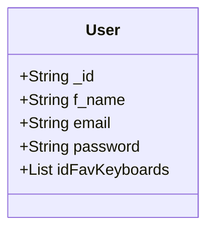
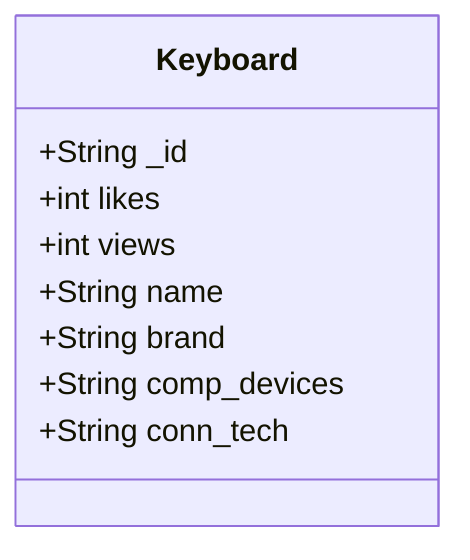

# User class Relation with the keyboard class

User Class Documentation  
String _id: Special object id generated by mongoDB.  
String f_name: User first name.  
String email: User email.  
String password: User hashed password  
List<String> idFavKeyboards: A list composed of unique object id of a keyboard object  

