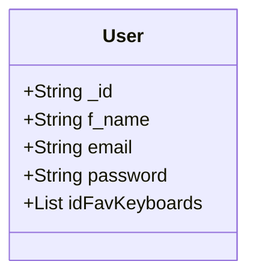
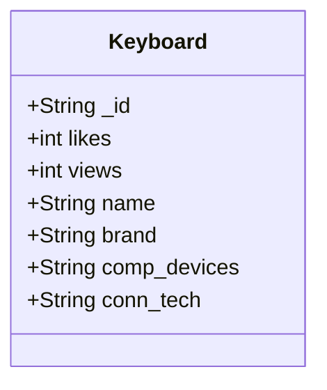

# User class Relation with the keyboard class

User Class Documentation \n
String _id: Special object id generated by mongoDB. \n
String f_name: User first name. \n
String email: User email. \n
String password: User hashed password \n
List<String> idFavKeyboards: A list composed of unique object id of a keyboard object \n

