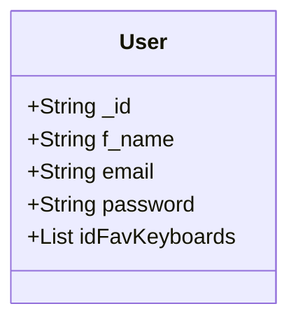
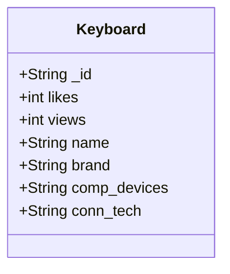

# User class Relation with the keyboard class

User Class Documentation \
String _id: Special object id generated by mongoDB. \ 
String f_name: User first name. \
String email: User email. \ 
String password: User hashed password
List<String> idFavKeyboards: A list composed of unique object id of a keyboard object 

